# ffplay2myplay

## Introduction

ffplay is a simple media player of FFmpeg. I separate it from FFmpeg and change it to ffplay.cpp.
So that we could integrate image processing algorithms into ffplay.  
`cmdutils.c`, `cmdutils.h` and `ffplay.c` come from ffmpeg-4.3.1/fftools. I modified them a little.

## How ffplay works

What does ffplay do: decode and display.


We could put algorithms into video_image_display() or upload_texture().



## Where I modified

### cmdutils.h

In line 249, parameter `class` is same as C++ key word, I changed it to `myclass`.

```c
// before
void show_help_children(const AVClass *class, int flags);
// after
void show_help_children(const AVClass *myclass, int flags);
```

### ffplay.cpp

header files of FFmpeg need to be wrapped by `extern "C" {}`.

```c
extern "C"
{
#include "libavutil/avstring.h"
#include "libavutil/eval.h"
#include "libavutil/mathematics.h"
#include "libavutil/pixdesc.h"
#include "libavutil/imgutils.h"
#include "libavutil/dict.h"
#include "libavutil/parseutils.h"
#include "libavutil/samplefmt.h"
#include "libavutil/avassert.h"
#include "libavutil/time.h"
#include "libavutil/bprint.h"
#include "libavformat/avformat.h"
#include "libavdevice/avdevice.h"
#include "libswscale/swscale.h"
#include "libavutil/opt.h"
#include "libavcodec/avfft.h"
#include "libswresample/swresample.h"

#if CONFIG_AVFILTER
# include "libavfilter/avfilter.h"
# include "libavfilter/buffersink.h"
# include "libavfilter/buffersrc.h"
#endif

#include "cmdutils.h"
}
```

In line 313, struct ShowMode need to be prefixed with `VideoState::`.

```c
#define ShowMode VideoState::ShowMode
#define SHOW_MODE_NONE ShowMode::SHOW_MODE_NONE
#define SHOW_MODE_VIDEO ShowMode::SHOW_MODE_VIDEO
#define SHOW_MODE_WAVES ShowMode::SHOW_MODE_WAVES
#define SHOW_MODE_RDFT ShowMode::SHOW_MODE_RDFT
#define SHOW_MODE_NB ShowMode::SHOW_MODE_NB
```

In line 3551, `parse_number_or_die()` return a double type which could not be converted to enum in C++. So I force it convert to Int.

```c
// before
parse_number_or_die(opt, arg, OPT_INT, 0, SHOW_MODE_NB-1);
// after
(int)parse_number_or_die(opt, arg, OPT_INT, 0, SHOW_MODE_NB-1);
```

## Requirements

- CMake >= 3.0
- GNU >= 5.4.0
- SDL2 >= 2.0
- FFmpeg == 4.3.1 or 4.3.2

## Installation

### SDL2 & yasm

```c
sudo apt install libsdl2-dev
sudo apt install yasm
```

### FFmpeg-4.3.1

```c
wget http://ffmpeg.org/releases/ffmpeg-4.3.1.tar.gz
tar -zxf ffmpeg-4.3.1.tar.gz
cd ffmpeg-4.3.1
mkdir build && cd build
// if cpu
./../configure --prefix=/usr/local/ffmpeg --enable-shared
make
sudo make install

// set environment variables
vim ~/.bashrc
// add them to file
export PATH=/usr/local/ffmpeg/bin:$PATH
export LIBRARY_PATH=/usr/local/ffmpeg/lib:$LIBRARY_PATH
export LD_LIBRARY_PATH=/usr/local/ffmpeg/lib:$LD_LIBRARY_PATH
// source to make it work
source ~/.bashrc
```

### Clone this repo

```c
git clone git@github.com:hanjialeOK/myplay
```

### Configuration

Modify CMakeLists.txt according to your own condition.

- set `FFMPEG_SOURCE` path/to/your/ffmpeg-4.3.1

    ```c
    set(FFMPEG_SOURCE ~/ffmpeg-4.3.1)
    ```

- set `FFMPEG_BUILD` path/to/where/you/build/ffmpeg-4.3.1

    ```c
    set(FFMPEG_BUILD ~/ffmpeg-4.3.1/build)
    ```

## Compile & Run

```c
cd myplay
mkdir build && cd build
cmake ..
make
./myplay test.mp4
```
